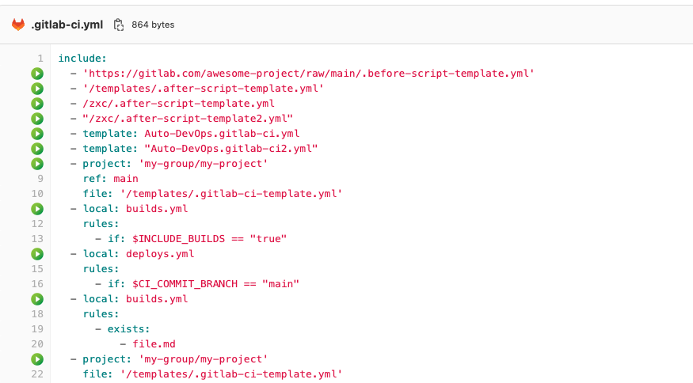

# Included Shortcut for GitLab™

A browser extension that helps you open included YAML files in GitLab™ with one click.

## Features

- Automatically detects `include:` statements in GitLab™ CI/CD YAML files
- Adds clickable links to quickly navigate to included files
- Supports all include types:
  - `local` includes
  - `remote` includes
  - `template` includes
  - `project` includes (with multiple files)
  - `component` includes

## Installation

1. Clone or download this repository
2. Open Chrome and navigate to `chrome://extensions/`
3. Enable "Developer mode"
4. Click "Load unpacked" and select this folder

## Usage

Simply navigate to any `.yml` or `.yaml` file in your GitLab™ instance. The extension will automatically add clickable icons next to `include:` statements.

## Trademark Notice

This extension is not affiliated, endorsed, sponsored, or approved with or by GitLab Inc.

GITLAB is a trademark of GitLab Inc. in the United States and other countries and regions.

For more information about GitLab trademark guidelines, visit: https://handbook.gitlab.com/handbook/marketing/brand-and-product-marketing/brand/brand-activation/trademark-guidelines/